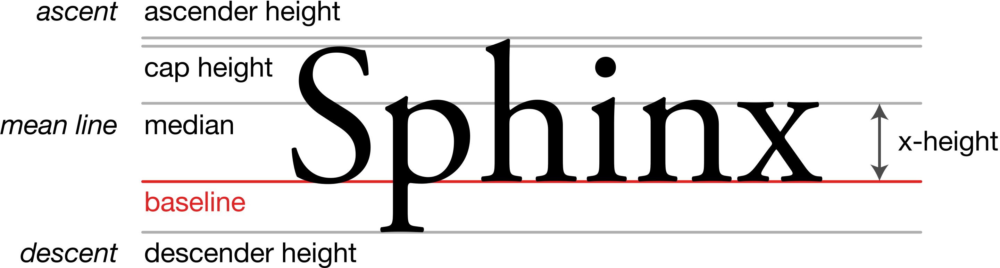

## 1. line-height的定义
`line-height`，中文又称行高，指的是两行文字**基线**之间的距离。
### 什么是基线？
  
### 为何是基线？
基线乃CSS中任意线定义之本
### 为什么需要两行？

## 为何`line-height`可以让单行文本垂直居中？

## 2. line-height与行内框盒子模型
所有内联元素的样式表现都与行内框盒子模型有关！例如浮动的图文环绕效果...

## 3. line-height的高度机理

## line-height明明是两基线距离，单行文字哪来的行高，还控制了高度？
- 行高由于其继承性，影响无处不在，即使单行文本也不例外
- 行高只是幕后黑手，高度的表现不是行高，而是内容区域和行间距
- 内容区域高度(content area) + 行间距(vertical spacing) = 行高(line-height)
  - 内容区域高度(content area)只与字号(font-size)以及字体(font-family)有关，与line-height没有任何关系。
  - 在simsun(宋体)字体下，内容区域高度等于文字大小值(font-size + 行间距 = line-height)。