# 问答题
## 请描述 event loop（事件循环/事件轮询）的机制，可画图
## 什么是宏任务和微任务，两者有什么区别？
## Promise有哪三种状态？如何变化？

# 知识点
## event loop (事件循环/事件轮询)
- JS是单线程的
- 异步要基于回调来实现
- event loop 就是异步回调的实现原理
### JS如何执行？
- 从前到后，一行一行执行
- 如果某一行执行报错，则停止下面代码的执行
- 先把同步代码执行完，再执行异步

### 总结 event loop 过程
- 同步代码，一行一行放在 call stack 执行
- 遇到异步，会先”记录“下，等待时机（定时，网络请求等）
- 时机到了，就移动到callback queue
- 如果 call stack 为空（即同步代码执行完）event loop 开始工作
- 轮询查找 callback queue，如果有代码，则移动到 call stack 执行
- 然后继续轮询查找
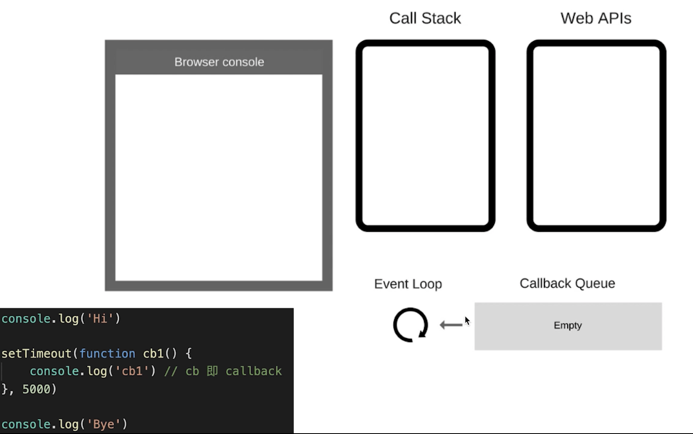
首先执行第一行代码，把`console.log('Hi')`放到call stack中然后执行。
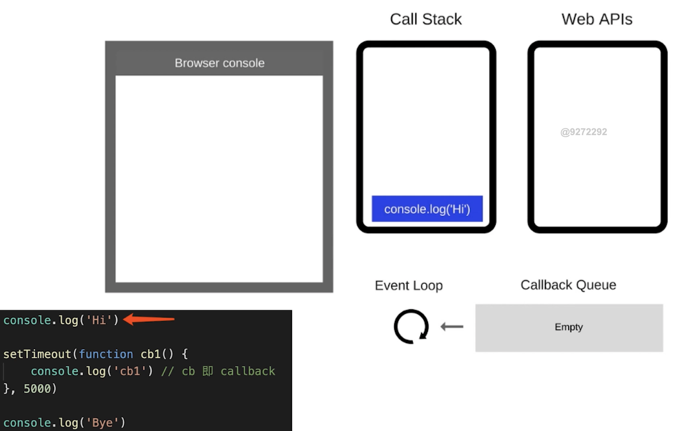
执行打印出`Hi`，执行完`console.log('Hi')`则从call stack中移除。
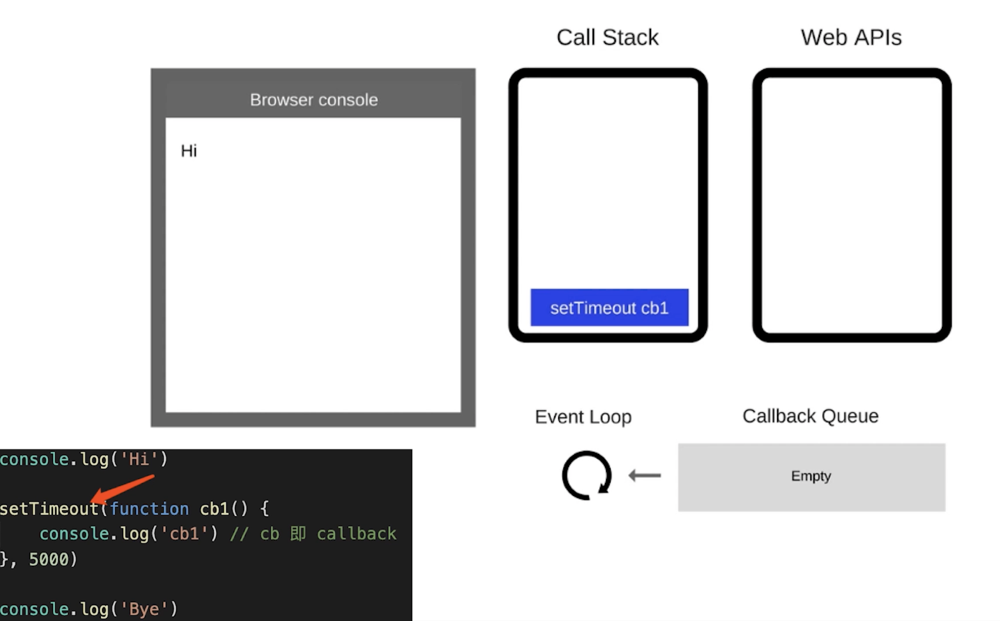
执行`setTimeout`函数，`setTimeout`函数把`cb1`函数放到了定时器中，这里是5s，5s对计算机来讲是非常久的。
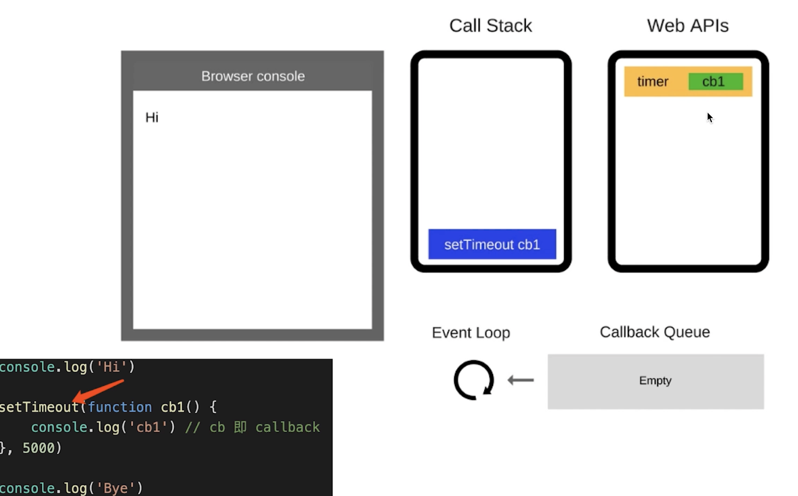
`setTimeout`函数执行完，从call stack中弹出。
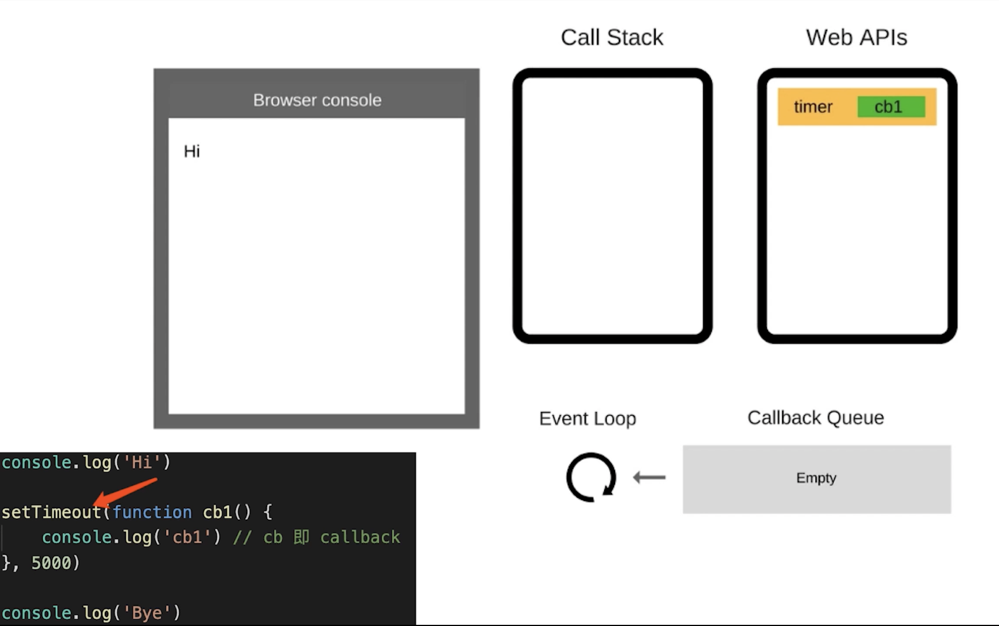
接下来执行`console.log('Bye')`。
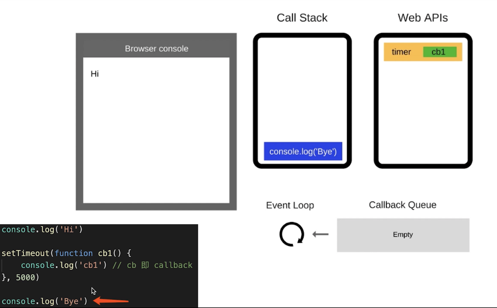
执行完`console.log('Bye')`之后，打印出`Bye`，然后弹出`console.log('Bye')`。此时，call stack 为空，event loop 开始工作。
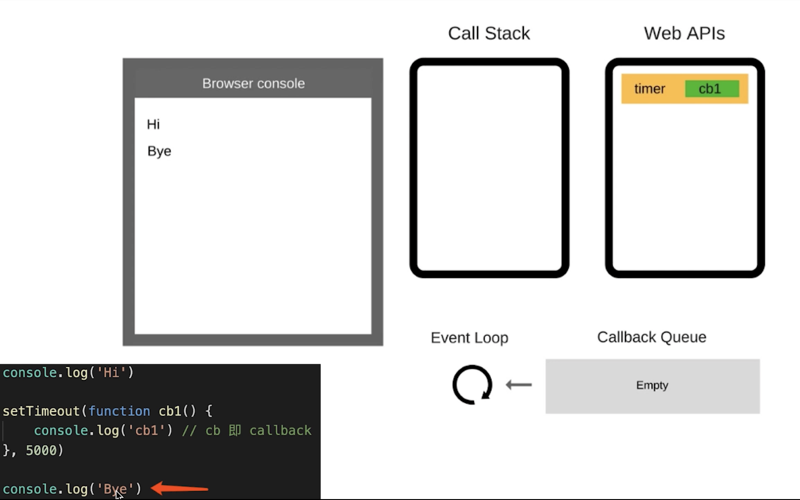
等到5s之后，定时器将`cb1`函数压入 callback queue 中。
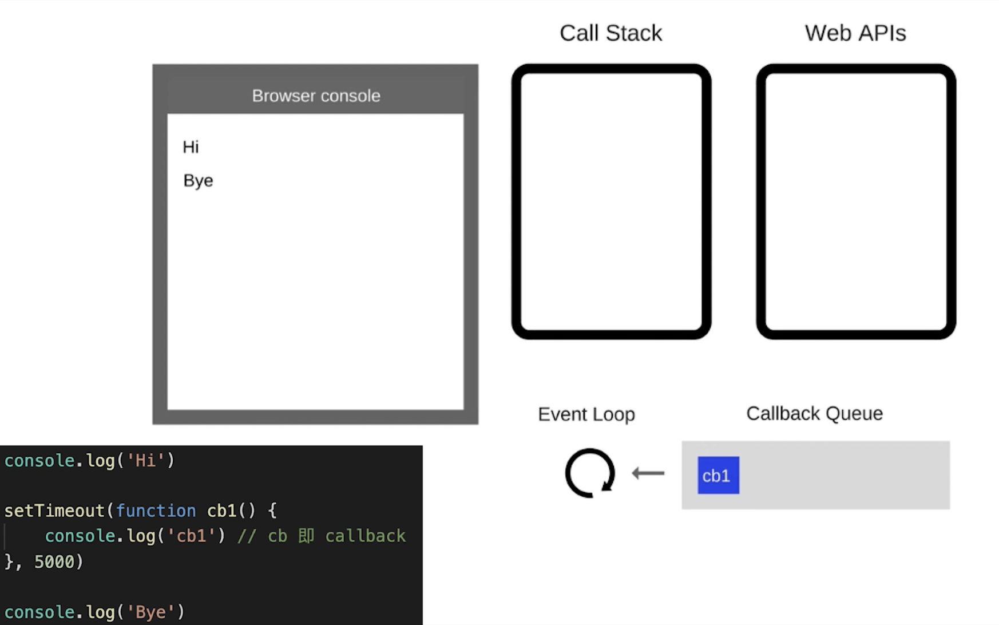
event loop 执行，将`cb1`函数压入 call stack 中。
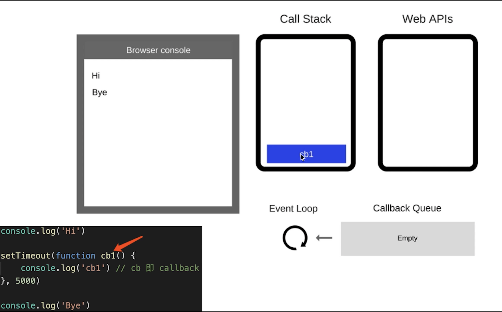
执行`cb1`函数。

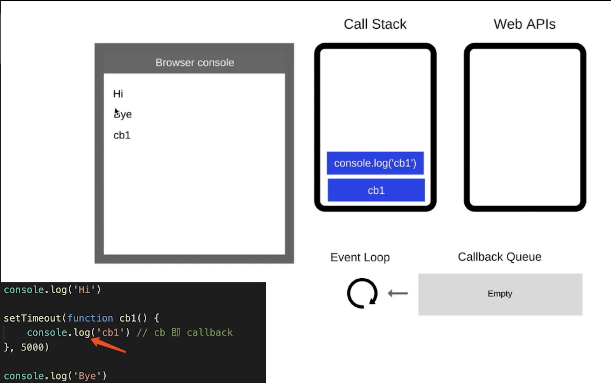
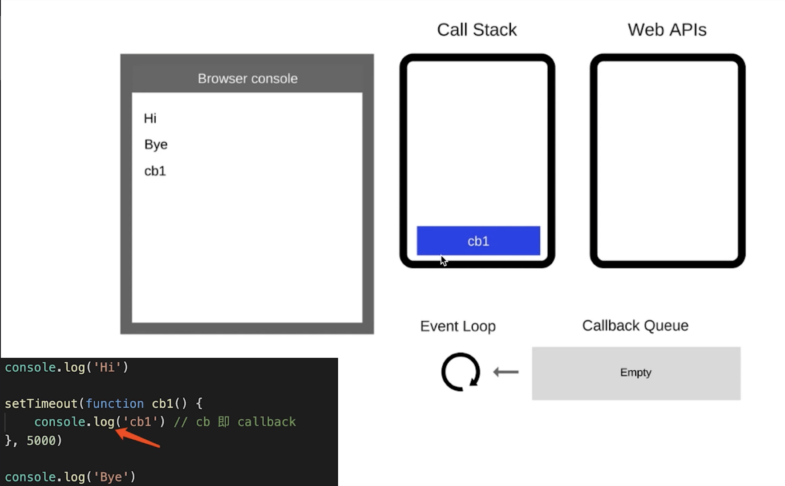
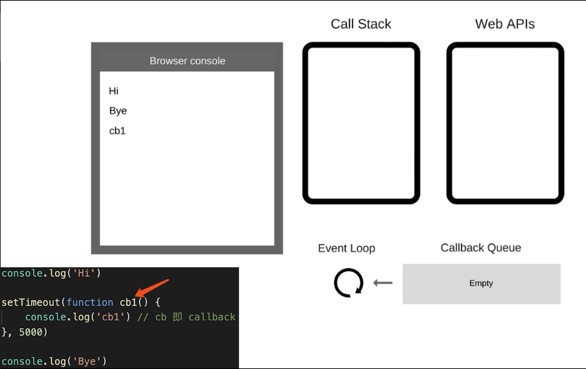

## DOM事件和event loop
```html
<button id="btn1">submit</button>
<script>
  console.log('Hi');
  $('#btn1').click(function(e){
    console.log('button clicked');
  })
  console.log('Bye');
</script>
```
- JS是单线程的
- 异步（setTimeout, ajax等）使用回调，基于event loop
- DOM事件也使用回调，基于event loop

## Promise
### Promise有哪三种状态
- 三种状态
- 状态的表现和变化
- then和catch对状态的影响
