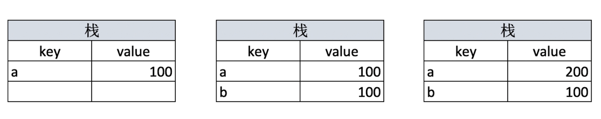
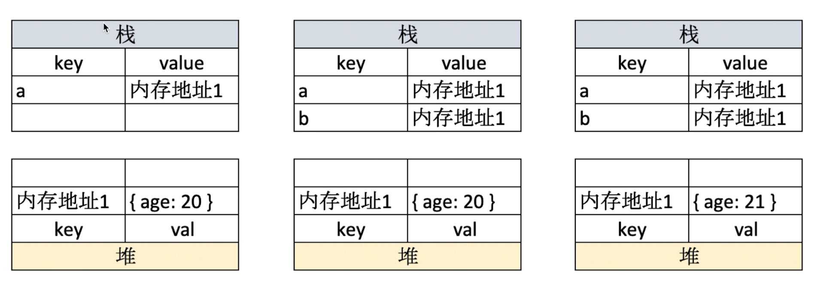

## 题目
- typeof能判断哪些类型
- 何时使用`===`何时使用`==`?
- 值类型和引用类型的区别
- 手写深拷贝

## `typeof`运算符功能
<details>
<summary>查看答案</summary>

- 识别所有值类型
- 识别函数
- 判断是否是引用类型（不可再细分）
</details>

## `typeof`运算符功能
- 识别所有值类型
  ```javascript
  let a
  const b = true
  const n = 123
  const str = 'abc'
  const big = 2n //A BigInt is created by appending n to the end of an integer or by calling the constructor.
  const bigi = BigInt(3)
  const s = Symbol('s')
	
  console.log(`typeof a ? ${typeof a}`); // undefined
  console.log(`typeof b ? ${typeof b}`); // boolean
  console.log(`typeof n ? ${typeof n}`); // number
  console.log(`typeof str ? ${typeof str}`); // string
  console.log(`typeof big ? ${typeof big}`); // bigint
  console.log(`typeof bigi ? ${typeof bigi}`); // bigint
  console.log(`typeof s ? ${typeof s}`); //symbol
  ```
- 识别函数
  ```javascript
  // 识别函数
  console.log(`typeof console.log ? ${typeof console.log}`); // function
  console.log(`typeof function () {} ? ${typeof function () {}}`); // function
  ```
- 判断是否是引用类型（不可再细分）
  ```javascript
  console.log(`typeof null ? ${typeof null}`); // object
  console.log(`typeof ['a', 'b'] ? ${typeof ['a', 'b']}`); // object
  console.log(`typeof {x: 9} ? ${typeof {x: 9}}`); // object
  const map = new Map()
  console.log(`typeof map ? ${typeof map}`); // object
  ```

# 变量计算-类型转换
## 字符串拼接
```javascript
const a = 100 + 10 //110(number)
const b = 100 + '10' //10010(string)
const c = true + '10' //true10(string)
```
## ==
## if语句和逻辑计算
经过两步非运算
- truly 变量：`!!a === true`的变量
- falsely 变量：`!!a === false`的变量
if语句判断的就是truly变量和falsely变量
逻辑判断也是用truly变量和falsely变量

## 值类型和引用类型区别
### 值类型
```javascript
const a // undefined
const s = 'abc' //string
const n = 100 //number
const b = true //boolean
const s = Symbol('s')//symbol
```

```javascript
// 值类型
let a = 100
let b = a
a = 200
console.log(b);
```
### 引用类型
```javascript
const obj = { x: 100 }
const arr = ['a', 'b', 'c']
const n = null // 特殊引用类型，指针指向为空地址
function fn() {
  // 特殊引用类型，但不用于存储数据，所以没有”拷贝、复制函数“一说
}
```

```javascript
// 引用类型
let a = { age: 20 }
let b = a //赋值的是内存地址
b.age = 21
console.log(a.age);
```
## 手写深拷贝
为什么要深拷贝
## 赋值，浅拷贝与深拷贝
```javascript
```