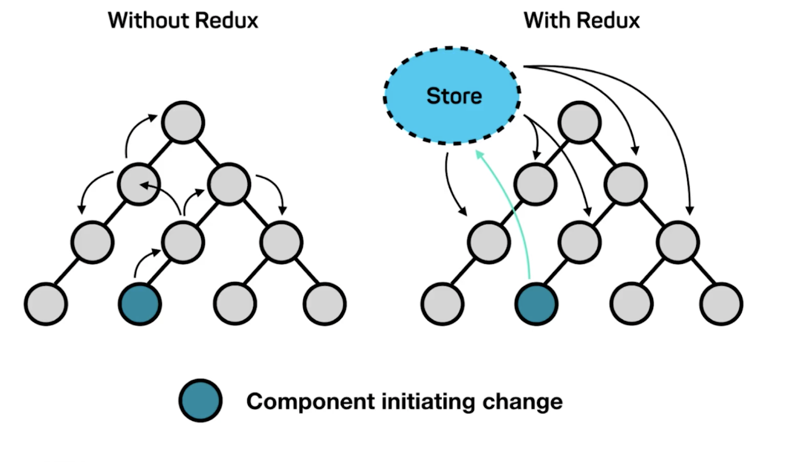
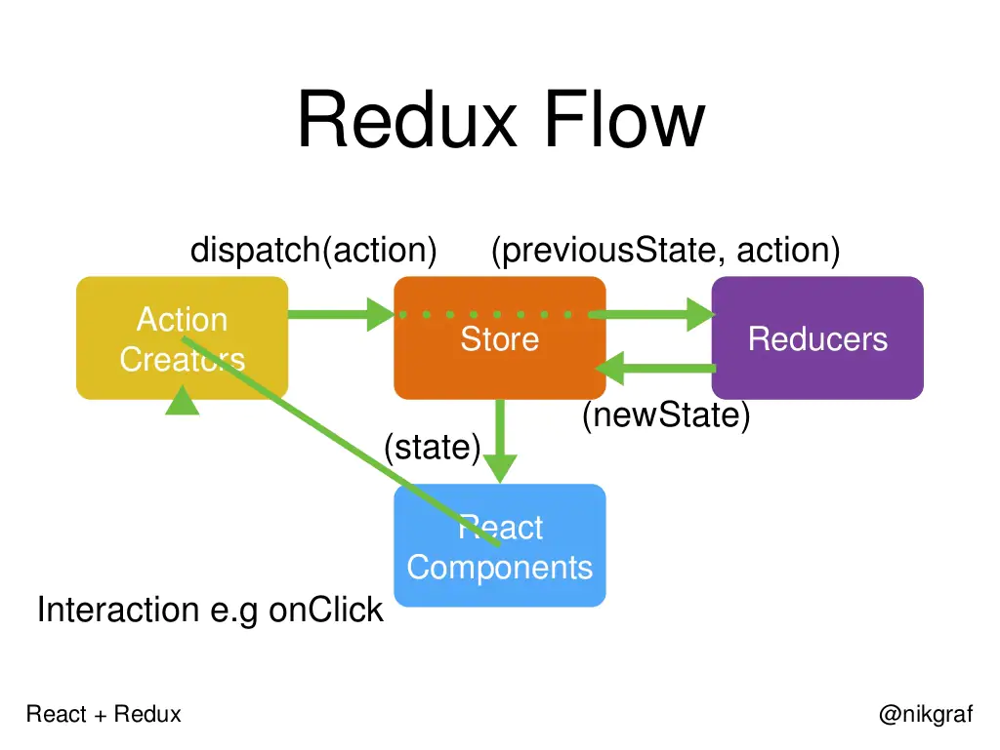

## 为什么用Redux
react本身是非常轻量级的视图层框架，如果只用react去写一个大型的应用，基本上是不可能的。因此需要给react配套一个数据层的框架，与react结合使用，这样才能hold住大型项目。

Redux是目前全球范围内与react搭配比较好的数据层框架。
当没有数据层框架，只有react时，组件之间传值会非常麻烦。Redux要求我们把数据都存在一个公共的存储区域（如图Store）中，组件之中尽量少放数据。当绿色组件想要改变数据去传给其他组件时，绿色组件只需要去改变store中自己对应的数据，接着灰色部分的组件会自动感知到store有变化了，store只要一有变化，灰色组件就会自动去store中重新取数据。那么绿色组件刚刚更新到store中的数据就可以被灰色组件取到了。这样，绿色组件就非常轻松地传递数据到其他灰色组件之中啦！
## Redux基本概念
**Redux = Reducer + Flux**

Flux是官方推出的最原始的辅助react的数据层框架。Flux的公共数据存储区域store部分可以有很多歌store所组成，这样数据存储的时候就可能存在一个数据依赖的问题。总之不是很好用，于是就有人把Flux做了一个升级，升级成了目前我们使用的Redux。Redux除了借鉴之前的Flux之外，还引入了Reducer的概念（后面会讲到）。目前Flux已经过时了。
## Redux术语
### Action
**action**是一个具有`type`字段的普通javascript对象。可以将action视为描述应用程序中发生了什么的事件。

`type`字段是一个字符串，给这个**action**一个描述性的名字，比如`'todos/todoAdded'`。我们通常把那个类型的字符串写成”域/事件名称“，其中第一部分是这个**action**所属的特征或类别，第二部分是发生的具体事情。

**action**对象可以有其他字段，其中包含有关发生的事情的附加信息。按照惯例，我们将该信息放在名为`payload`的字段中。

一个典型的**action**对象可能如下所示：
```javascript
const addTodoAction = {
  type: 'todos/todoAdded',
  payload: 'Buy milk'
}
```
### Action Creator
**action creator**是一个创建并返回一个**action**对象的函数。它的作用是让你不必每次都手动编写**action**对象：
```javascript
const addTodo = text => {
  return {
    type: 'todos/todoAdded',
    payload: text
  }
}
```
### Reducer
**reducer**是一个函数，接收当前的`state`和一个`action`对象，必要时决定如何更新状态，并返回新状态：`(state, action) => newState`。可以将**reducer**视为一个事件监听器，它根据接收到的action（事件）类型处理事件。

**reducer**必须符合以下规则：

## Redux的工作流程



