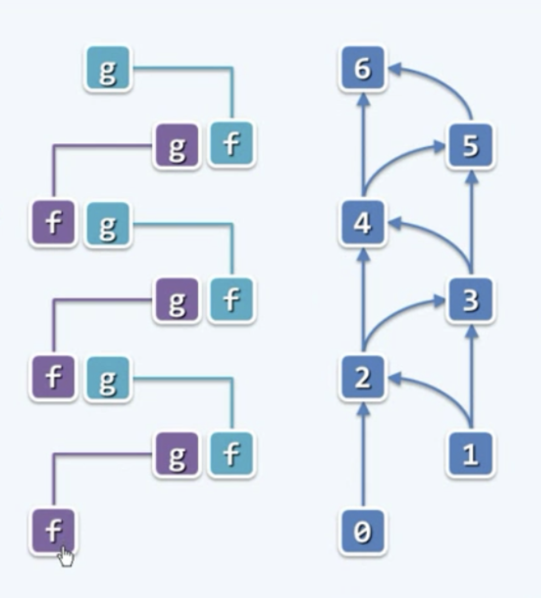

# 动态规划
递归 -> 迭代
从某种意义上讲，所谓的动态规划，也可以理解为通过递归，找出算法的本质并给出一个初步的解之后，再将其等效地转化为迭代的形式。
## fib()：递归
fib(n) = fib(n-1) + fib(n-2):{0, 1, 1, 2, 3, 5, 8, ...}
```javascript
var fib = function(n) {
    return n<2 ? n : fib(n-1) + fib(n-2)
};
```
复杂度：O(2^n)
递归版fib()低效的根源在于，各递归实例均被大量重复地调用。
## fib()：迭代
### 解决方法A（记忆：memoization）
将已计算过实例的结果制表备查
### 解决方法B（动态规划：dynamic programming）
颠倒计算方向：由自顶而下递归，为自底而上迭代

用f和g分别来记忆当前所处的相邻的两极台阶，最开始是0和1，接下来是1和2，再往后是2和3，一直到最后。每一次迭代都通过`g = f + g; f = g - f;`更新变量f和g，使它们始终指向这个楼梯中相邻的两阶。也可以说是在Fibonacci数列中，当前相邻的两项，它们整体地呈现一种交替的滚动的方式向前推进，直到我们希望得到的最终的解。
```javascript
var fib = function(n) {
    if (n < 2) return n
    let f = 0,g = 1,i = 2,sum = 0

    while( i <= n ){
        sum = f + g
        f = g
        g = sum
        i++
    }
    
    return sum
};
```
精简一下（邓俊辉老师的解法）
```javascript
var fib = function(n) {
    if (n < 2) return n
    
    let f = 0,g = 1
    while( 1 < n-- ){
        g = f + g
        f = g - f
    }

    return g
};
```
复杂度：O(n)